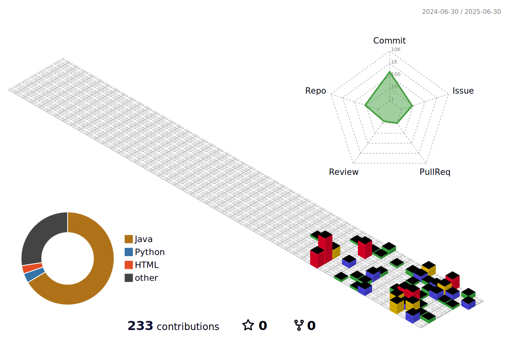

<h3 align="center">I am a student majoring in artificial intelligence software at Cheongju University.</h3>

<h3 align="left">Connect with me:</h3>

<h3 align="left">Languages and Tools:</h3>

 

 
  
 
 
 
  
<pr>DataBase</pr> 
 
 

 

 

 

 

 

 

 
 
 

<picture>
  <source
    srcset="https://github-readme-stats.vercel.app/api/top-langs/?username=Adelio-IN&show_icons=true&theme=dark"
    media="(prefers-color-scheme: dark)"
  />
  <source
    srcset="https://github-readme-stats.vercel.app/api?username=Adelio-IN&show_icons=true"
    media="(prefers-color-scheme: light), (prefers-color-scheme: no-preference)"
  />
  
</picture>

